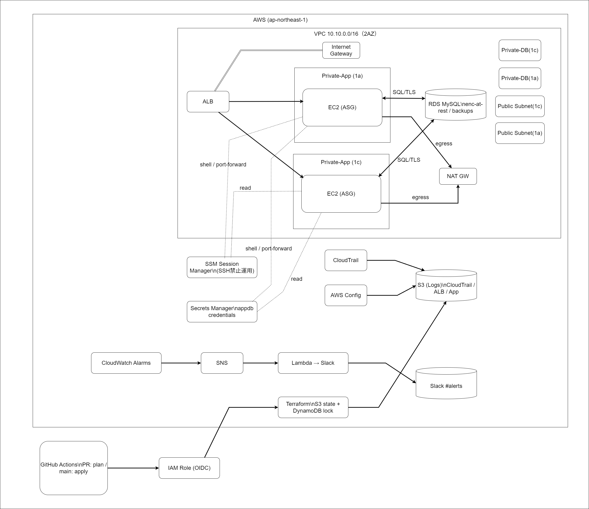

# 小さな本番環境 on AWS（Terraform）

 

<!-- TODO: put screenshots/architecture.png and uncomment next line -->
<!--  -->

**AWS(ap-northeast-1)に VPC / ALB+ASG(EC2) / RDS(MySQL) / S3(Logs) / 監視通知 / CI/CD(OIDC) を最小コストで構築するポートフォリオ。**  
再現性・セキュリティ・運用性を重視し、すべてをコード化。

### 特徴（Highlights）
- **IaC**: Terraform（S3 + DynamoDB Backend）
- **運用**: CloudWatch → SNS → Lambda → Slack
- **監査**: CloudTrail / AWS Config
- **CI/CD**: GitHub Actions（OIDC, PR=plan / main=apply）
- **セキュリティ**: IAM最小権限、IMDSv2必須、SSH禁止（SSM運用）、S3 Public Block

---

## Quick Start
\\\ash
# 初期化（バックエンドを明示）
terraform -chdir=infra/envs/prod init 
  -backend-config="bucket=mini-prod-tfstate-hoooo2025" 
  -backend-config="key=prod/terraform.tfstate" 
  -backend-config="region=ap-northeast-1" 
  -backend-config="dynamodb_table=mini-prod-tflock"

# 差分確認
terraform -chdir=infra/envs/prod plan

# 適用
terraform -chdir=infra/envs/prod apply -auto-approve
\\\

---

## 構成概要
- **VPC**: /16（Public×2, Private-App×2, Private-DB×2）, NAT×1  
- **Web/App**: ALB → ASG(EC2 AL2023), IMDSv2必須, SSH禁止（SSM）  
- **DB**: RDS MySQL（単一AZ, 暗号化, バックアップ+PITR, TLS必須）  
- **監視**: CPU / ALB5xx / Target5xx / StatusCheckFailed → Slack通知  
- **監査**: CloudTrail（S3: \mini-prod-logs-hoooo2025\）, AWS Config 基本ルール  
- **CI/CD**: GitHub Actions（OIDC, 長期アクセスキー不使用）

---

## リポ構成
\\\
infra/
  envs/prod/        # backend.hcl / providers.tf / main.tf / iam_gha.tf / variables.tf
  modules/          # vpc, alb, asg_ec2, rds, s3_logs, cloudwatch, sns_slack, iam_oidc_github
docs/
  ARCHITECTURE.md / RUNBOOK.md / SECURITY.md / COST.md / CI-CD.md / TROUBLESHOOTING.md
screenshots/
  architecture.png  # 他: actions-apply.png, slack-alerts.png など
\\\

---

## ドキュメント
- [ARCHITECTURE.md](./docs/ARCHITECTURE.md)（構成と設計理由）
- [RUNBOOK.md](./docs/RUNBOOK.md)（運用手順）
- [SECURITY.md](./docs/SECURITY.md)（セキュリティ方針）
- [COST.md](./docs/COST.md)（コスト）
- [CI-CD.md](./docs/CI-CD.md)（パイプライン）
- [TROUBLESHOOTING.md](./docs/TROUBLESHOOTING.md)

## 成功基準（SLO）
- applyから**30分以内**に稼働／ALB経由200／ASG自己復旧  
- Slackに4種通知／SSM運用／OIDC apply／destroyで撤収可

**Evidence**: \docs/evidence/\ を参照
